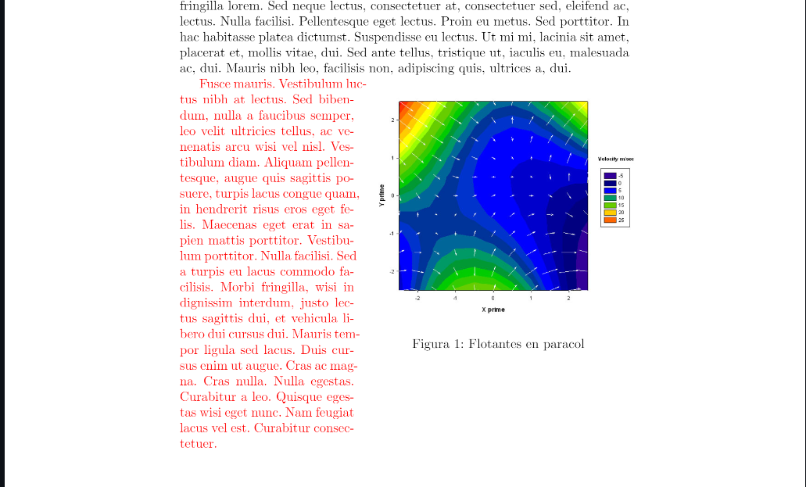

# [Final File](Caratula/caratula.pdf)
#[Code](Caratula/caratula.tex)


# LATEX APA 7th

Debemos usar el tipo de documento `apa`.

```latex
\documentclass{apa}
```

### Escritura en Español

1. Usar la opcion `utf8` del paquete `inputenc`
2. Usar la opcion `spanish` del paquete `babel`

```latex
\usepackage[utf8]{inputenc}
\usepackage[spanish]{babel}
```

### Portada del Documento

1. Usar `\title{}` para el titulo del documento.
2. Usar `\author{}` para el autor del documento.
3. Usar `\date{}` para la fecha del documento, si dentro de los corchetes colocamos `\today`, se pondra la fecha de la
   ultima compilacion.

```latex
\title{Calculo Diferencial e Integral}
\author{Cristian Herrera}
\date{\today}
```

Para que la portada se muestre en el documento, debemos usar el comando `\maketitle`, despues de `\begin{document}`.

```latex
\begin{document}
\maketitle
```

#### Abstract del Documento

Debera ir despues de `\begin{document}`.

```latex
\begin{document}
\begin{abstract}
    ..................................
    ..................................
\end{abstract}
```

### Tabla de Contenidos

Para crear la tabla de contenidos, debemos usar el comando `\tableofcontents`, despues de `\maketitle`.

```latex
\begin{document}
\maketitle
\tableofcontents
```

### Secciones numeradas en el indice

Las secciones numeradas se muestran en la tabla de contenidos,estaran numeradas si se usa un `\documentclass{}`
con `article`, en este caso estamos usando el `apa`.

```latex
\section{soy un section}
    \subsection{soy un subsection}
        \subsubsection{soy un subsubsection}
```

**Adicional:** Si estubieramos usando un  `documentclass{}` con `article`, las secciones estarian numeradas, pero si
queremos que no esten numeradas, debemos usar un asterisco `*` despues del comando.

```latex
\section*{soy un section no numerada}
    \subsection*{soy un subsection no numerada}
        \subsubsection*{soy un subsubsection no numerada}
```

### Secciones no numeradas

Las secciones no numeradas no se muestran en la tabla de contenidos, estas se ubican despues de `\subsubsection{}`.

```latex
\paragraph{soy un paragraph}
\subparagraph{soy un subparagraph}
```

\usepackage{amsmath}

# ADICIONALES

### Multiples Columnas
- ### paracol
El ambiente `paracol` permite escribir en multiples columnas, se debe usar el paquete `paracol`, **aqui si podemos insertar elementos flotantes como tablas o figuras**.

```latex
\usepackage{paracol}
```
```latex
\columnratio{.6} % ancho de la columna 1 (primera a la izquierda)
\begin{paracol}{2}
    ...........
    ...........
    ...........
    \switchcolumn
    \begin{figure}[ht] % Inserta una figura
        \centering
        \includegraphics[scale=.35]{2Dvectorplot.jpg}
        \caption{Flotantes en paracol}
    \end{figure}
\end{paracol}
```


- ### multicol
El ambiente `multicols` permite escribir en multiples columnas, se debe usar el paquete `multicol`, La desventaja es que
**no podemos insertar elementos flotantes como tablas o figuras**.

```latex  
\usepackage{multicol} 
```

```latex
\begin{multicols}{2}
    \lipsum[1-2]
\end{multicols}
```

Para la separacion entre columnas debemos `\setlength\columnsep{<distancia_separacion>cm}` antes
de `\begin{multicols}{<cantidad_de_columnas>}`.

```latex
......................................
......................................
\setlength\columnsep{1cm}
\begin{multicols}{3}
    ......................................
    ......................................
\end{multicols}
```


`\columnbreak` para forzar un salto de columna.

```latex
\begin{multicols}{2}
    ............
    ............
    \columnbreak
    ............
    ............
\end{multicols}
```

#### Caracteres Especiales y Otros

- ` \ ` para escribir comandos, tambien es un caracter de escape(escribir simbolos).
- `\\` para salto de linea.
- `\\[2cm]` para salto de linea de 2cm.
- `\hspace{4cm}` para espacio horizontal de 4cm.
- `\vspace{4cm}` para espacio vertical de 4cm.
- `%` para comentar.
- `&` para separar columnas en tablas o entornos(matrices).
- `^` para superindices.
- `_` para subindices.

#### Entornos

- `itemize` para listas sin orden.
- `enumerate` para listas con orden.
- `description` para listas con descripcion.
- `center` para centrar.
- `flushleft` para alinear a la izquierda.
- `flushright` para alinear a la derecha.
- `tabular` para tablas, se puede usar dentro del entorno `table`.
- `figure` para figuras.
- `table` para tablas.
- `equation` para ecuaciones.
- `equation*` para ecuaciones sin numerar.
- `pmatrix` para matrices con parentesis.
- `bmatrix` para matrices con corchetes.
- `vmatrix` para matrices con barras verticales.

#### Paquetes

- `amsmath` para matematicas.
- `amssymb` para simbolos matematicos.
- `amsthm` para teoremas.
- `babel` para idiomas.
- `geometry` para personalizar el diseño de la pagina.
- `graphicx` para incluir imagenes.
- `hyperref` para hipervinculos.
- `inputenc` para caracteres especiales.

#### Estructura del documento

- `\title{}` para el titulo del documento.
- `\author{}` para el autor del documento.
- `\date{}` para la fecha del documento, si dentro de los corchetes colocamos `\today`, se pondra la fecha de la ultima
  compilacion.
- `\maketitle` para crear la portada.
- `\newpage` para crear una nueva pagina.
- `\tableofcontents` para crear el indice.
- `\section{}` para crear una seccion.
- `\subsection{}` para crear una subseccion.
- `\subsubsection{}` para crear una subsubseccion.
- `\paragraph{}` para crear un parrafo.
- `\subparagraph{}` para crear un subparrafo.
